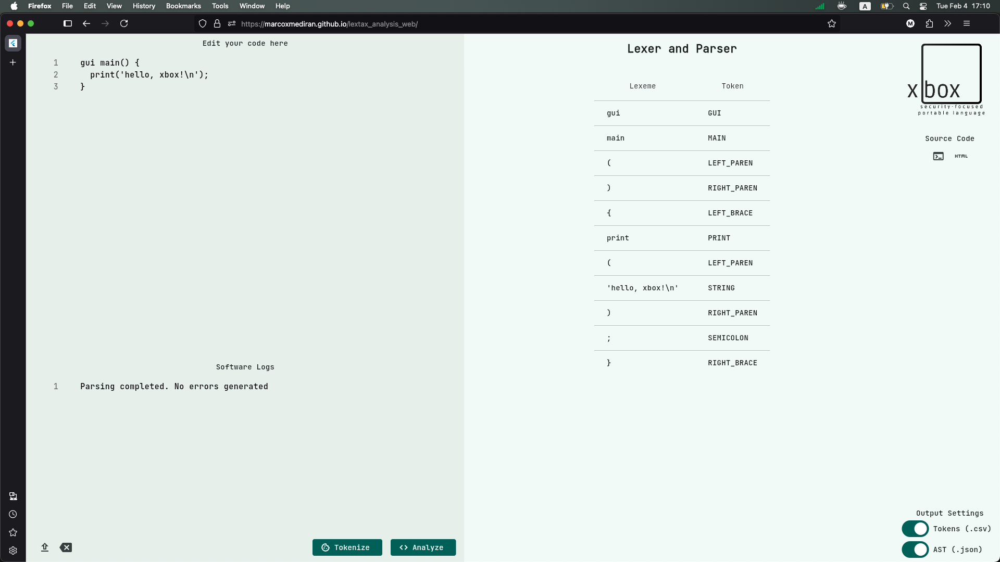

# lextax_analysis
This repository contains the source code responsible for tokenizing and parsing the xbox programming language.

## Test On Your Own
```bash
# Clone the repository and fetch project dependencies
git clone https://github.com/marcoxmediran/lextax_analysis.git
cd lextax_analysis
flutter pub get

# Test the web app
flutter run -d chrome   # use "-d web-server" if you want to use a different browser
```
## Building For Deployment
```bash
export REPO_NAME="GITHUB_REPOSITORY_NAME"
flutter build web --base-href=$REPO_NAME
```
